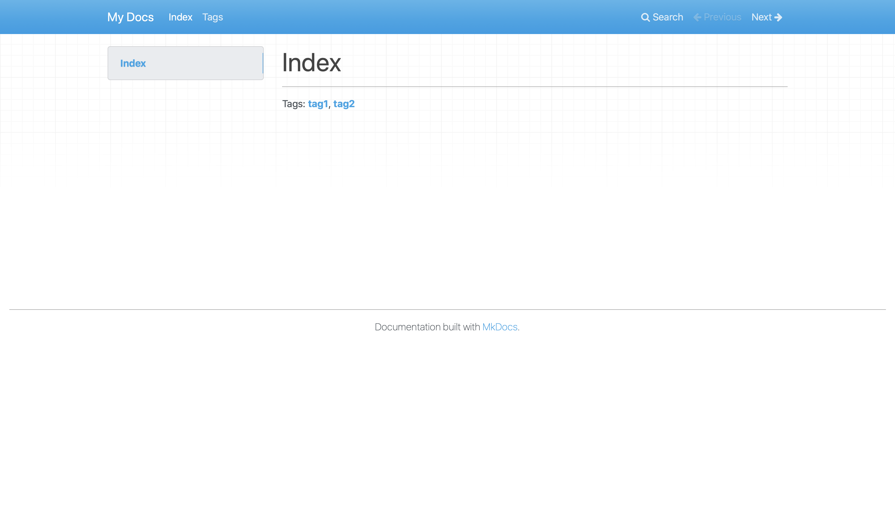

# MkDocs Tags Plugin

An [MkDocs](https://www.mkdocs.org) plugin for tags support.

**Features might not be backward compatible until v1.0.**

## Installation

```bash
pip install git+https://github.com/Nick-SHM/mkdocs-tags.git
```

Installation through [PyPI](https://pypi.org) will be available in the future.

## Quick Start

Create an MkDocs site:

```bash
mkdocs new demo
```

Add `tags` to the `plugins` entry of `mkdocs.yml`.

```yaml
site_name: My Docs

plugins:
    - search
    - tags
```

_Note that if you have previously omitted this entry, you'll likely want to enable the plugin `search` as well. MkDocs enables it by default, but now you have to enable it explicitly._

Add tags to a page as a list in the `tags` entry of the [metadata section](https://www.mkdocs.org/user-guide/writing-your-docs/#meta-data). For example, change `index.md` to:

```
---
tags:
    - tag1
    - tag2
---

# Index
```

Then, by default, a list of tags will be generated on the bottom of the page, if the page contains at least one tag.



Create `tags.md` in `docs/`. This file will contain a list of all tags and the pages under each of them.


You can add this page to an arbitrary place under the `nav` entry in `mkdocs.yml`. This page can also have tags, but by default, all the content in the file other than the metadata and the title will be ignored.

## Customization

Customization options should be put in `mkdocs.yml` under the plugin entry. For example:

```yaml
plugins:
    - search
    - tags:
          tag_page_md_path: path/to/tags/page.md
```

### Tags Page

A page with a list of all tags and the pages under each of them will be rendered using [Jinja](https://jinja.palletsprojects.com). Customization options includes:

#### `tag_page_md_path`

The path, relative to `docs/`, to the markdown file which will be rendered as the tag page. The default value is `tags.md`.

#### `tag_page_tmplt_path`

The path, **relative to `docs/`**, to the Jinja template file. It takes precedence over `tag_page_tmplt`.

#### `tag_page_tmplt`

The template as a string. `tag_page_tmplt` takes precedence over it.

#### The Template

If neither `tag_page_tmplt` nor `tag_page_md_path` is set, the default template is:

```jinja
# {{page.title}}

## {{tag.name}}

* [{{ page_info.title }}]({{ page_info.rel_path }})

}
```

Variables available for the template include:

##### `tags_and_pages`

A `Dict[_TagInfo, List[_PageInfo]]` containing tag and page info.

`_TagInfo` class has attributes `name` and `permalink` (permalink suffix without `#`).

`_PageInfo` class has attributes `title`, `abs_path`, and `rel_path` (relative path to the tag page).

##### `markdown`

The markdown source of the page, in a `str`.

##### `page`

The `mkdocs.structure.pages.Page` object of the current page. For more info, see [MkDocs documentation](https://www.mkdocs.org/user-guide/custom-themes/#page) and [MkDocs source code](https://github.com/mkdocs/mkdocs/blob/master/mkdocs/structure/pages.py).

##### `config`

The global `mkdocs.config.base.Config` object of the site. For more info, see [MkDocs documentation](https://www.mkdocs.org/user-guide/custom-themes/#config) and [MkDocs source code](https://github.com/mkdocs/mkdocs/blob/master/mkdocs/config/base.py).

### On-page Tag List

A list of tags will be rendered on the bottom of each page using [Jinja](https://jinja.palletsprojects.com). Customization options include:

#### `on_page_tmplt_path`

The path, **relative to `docs/`**, to the Jinja template file. It takes precedence over `on_page_tmplt`.

#### `on_page_tmplt`

The template as a string. `on_page_tmplt_path` takes precedence over it.

#### The Template

If neither `on_page_tmplt_path` nor `on_page_tmplt` is set, the default template is:

```jinja
{{markdown}}


---

Tags: **{{ tags | join("**, **") }}**

```

Variables available for the template include:

##### `tags`

All the tags of this page, in a `list[_Tag_Info]`. See [above](#tags_and_pages) for info about `_Tag_Info`.

##### `tag_page_md_rel_path`

The path to the tag page, relative to the current page.

##### `markdown`

The markdown source of the page, in a `str`.

##### `page`

The `mkdocs.structure.pages.Page` object of the current page. For more info, see [MkDocs documentation](https://www.mkdocs.org/user-guide/custom-themes/#page) and [MkDocs source code](https://github.com/mkdocs/mkdocs/blob/master/mkdocs/structure/pages.py). Not all the attributes of `page` is available when the plugin renders the page.

##### `config`

The global `mkdocs.config.base.Config` object of the site. For more info, see [MkDocs documentation](https://www.mkdocs.org/user-guide/custom-themes/#config) and [MkDocs source code](https://github.com/mkdocs/mkdocs/blob/master/mkdocs/config/base.py).

## Changelog

See [CHANGELOG.md](CHANGELOG.md)

## License

This project is under [Apache License 2.0](LICENSE).
