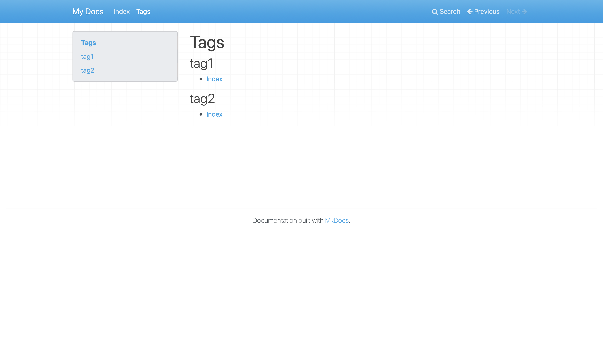

# MkDocs Tags Plugin

A tags plugin for [MkDocs](https://www.mkdocs.org).

## Installation

```bash
pip install git+https://github.com/Nick-SHM/mkdocs-tags.git
```

Installation through [PyPI](https://pypi.org) will be available in the future.

## Quick Start

Create an MkDocs site:

```bash
mkdocs new demo
```

Add `tags` to the `plugins` entry of `mkdocs.yml`.

```yaml
site_name: My Docs

plugins:
    - search
    - tags
```

_Note that if you have previously omitted this entry, you'll likely want to enable the plugin `search` as well. MkDocs enables it by default, but now you have to enable it explicitly._

Add tags to a page as a list in the `tags` entry of the [metadata section](https://www.mkdocs.org/user-guide/writing-your-docs/#meta-data). For example, change `index.md` to:

```
---
tags:
  - tag1
  - tag2
---

# Index
```

Then a list of tags will be generated at the bottom of the page, if the page contains at least one tag.


Create `tags.md` in `docs/`. This file will contain a list of all tags and the pages under each of them.



You can add this page to an arbitrary place under the `nav` entry in `mkdocs.yml`. This page can also have tags, but the all the content in the file other than metadata and the title will be ignored.

## How it Works and How to Customize

## License

This project is under [Apache License 2.0](LICENSE).
